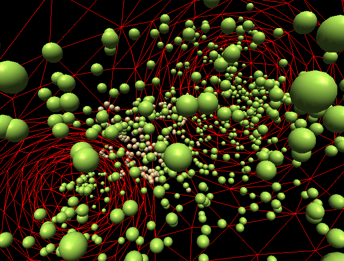

# Multi-Physics Solver ([URL](http://mulphys.com))
## Author: [Andrei V Smirnov](andrei.v.smirnov@gmail.com)

MulPhys 
solves the equations for fluid flow (CFD), elasticity (FEM), and discrete element dynamics (DEM).
It is based on the Generalized Element Method (GEM) where the elements are geometrical constructs of various dimensionality representing different physical entities:

- 0: points -> particles
- 1: edges -> bonds
- 2: faces -> membranes
- 3: cells -> volumes

Each entity can be assigned certain physical properties, such as mass,
elasticity, viscosity, pressure, etc., depending on the physical model.  A
mechanism can be provided for exchange of properties between the entities. This
way both solid and fluid mechanics can be specified in a unified manner.

## [Method](doc/mulphys.pdf)

## [DOCS](doc/)

### [Overview](http://galacticbubble.com/mulphys/overview.html)
### Presentation
 [ODP](http://galacticbubble.com/mulphys/doc/mulphys.odp)
 [PPTX](http://galacticbubble.com/mulphys/doc/mulphys.pptx)
 [HTML](http://galacticbubble.com/mulphys/doc/overview/)

### [Papers](http://galacticbubble.com/mulphys/docs.html)
